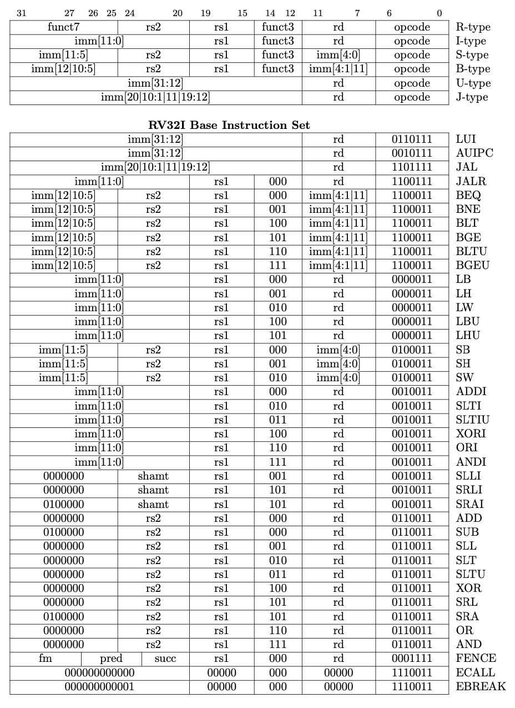
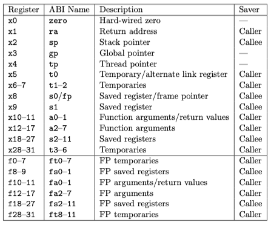

# Tinysambler

Tinysambler is an assembler for the RISC-V RV32I instruction set, written in Rust. It translates assembly instructions into their corresponding machine code and supports all instruction types defined in the RV32I specification.

## Table of Contents

- [Features](#features)
- [Prerequisites](#prerequisites)
- [Getting Started](#getting-started)
  - [Building the Project](#building-the-project)
- [Contributing](#contributing)
- [License](#license)

## Features

- **Complete RV32I Support**: Implements all 40 unique instructions of the RV32I base integer instruction set.


- **Support For Both Register Naming Convetions**: x0-x31 and ABI name


- **Efficient Assembly**: Converts RISC-V assembly code into machine code efficiently, leveraging Rust's performance and safety features.

## Prerequisites

Before building Tinysambler, ensure you have the following installed:

- **Rust**: Including the Cargo build system. You can install Rust and Cargo by following the instructions at [rust-lang.org](https://www.rust-lang.org/tools/install).

## Getting Started

### Building the Project

To build Tinysambler, follow these steps:

```bash
git clone https://github.com/duolok/tinysambler.getting-started
cd tinysambler
cargo build --release
```

### Run tests:

```bash
cargo test
```

## Contributing

If you'd like to contribute to TinyGit, feel free to submit issues or pull requests on the repository.
Make sure your code follows the existing style and includes necessary tests.

## License

This project is licensed under the MIT License.
